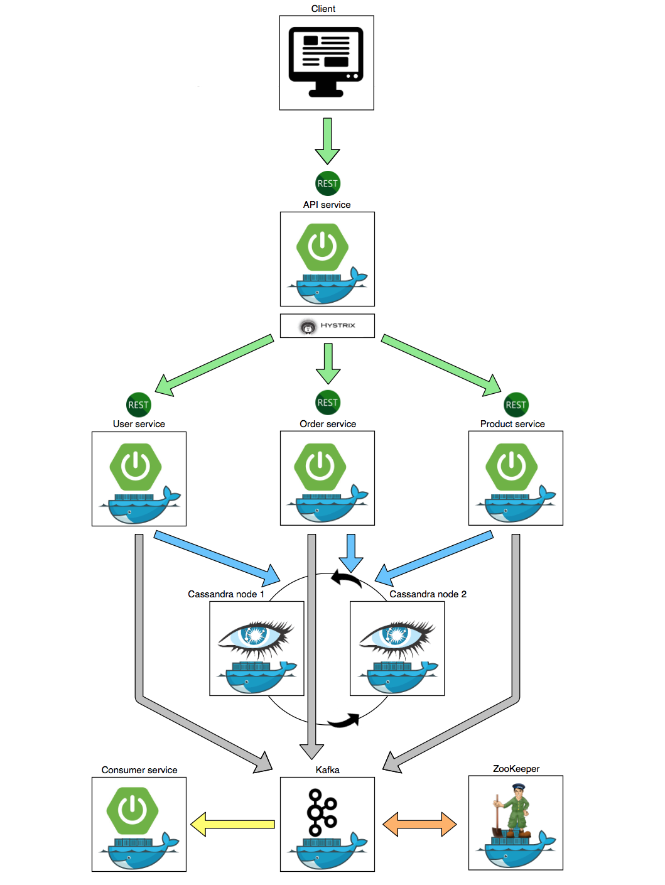

### Introduction

reference dockerized cloud microservices with spring boot rest, cassandra, kafka &amp; zookeeper

`Pet` microservices project.

* Docker
* Spring Boot
* Cassandra
* ZooKeeper
* Kafka
* REST API

### Developer Environment

Build docker images
```
chmod +x ./docker-build.sh && ./docker-build.sh
```
Run
```
docker-compose up
```

### Architecture



